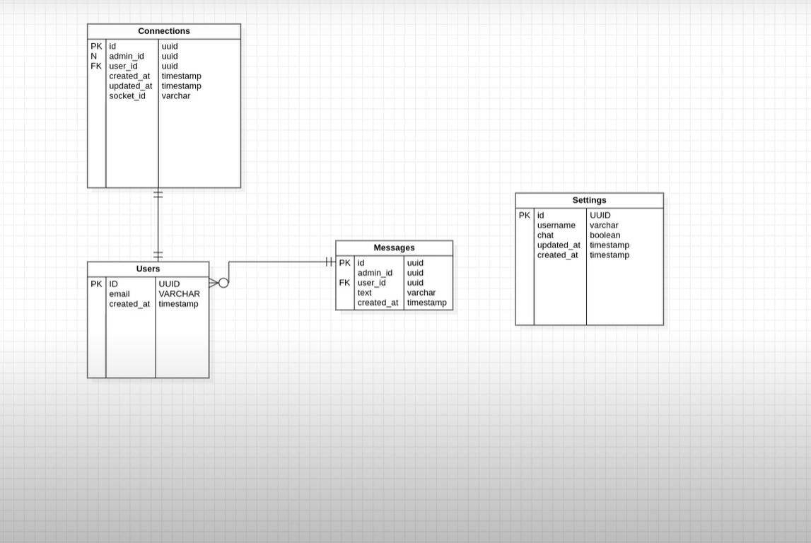

# NLW5-Chat

<h1 align="center">NLW5-Chat | Rocketseat</h1>

  <a href="#-tecnologias">Tecnologias</a>&nbsp;&nbsp;&nbsp;|&nbsp;&nbsp;&nbsp;
  <a href="#-projeto">Projeto</a>&nbsp;&nbsp;&nbsp;|&nbsp;&nbsp;&nbsp;
  <a href="#-como-executar">Como executar</a>&nbsp;&nbsp;&nbsp;|&nbsp;&nbsp;&nbsp;
  <a href="#-licença">Licença</a>

  

 

 

## ✨ Tecnologias e Softwares

Esse projeto foi desenvolvido com as seguintes tecnologias e softwares:

- [TypeScript](https://www.typescriptlang.org/)
- [TypeORM](https://typeorm.io/#/)
- [Websocket](https://www.npmjs.com/package/websocket)
- [SQlite](https://www.sqlite.org/index.html)
- [Insomnia](https://insomnia.rest/)
- [SQL Editor Beekeeper Studio](https://www.beekeeperstudio.io/)

## 💻 Projeto

O NLW-Chat é uma aplicação que consiste em melhorar a experiência do usuário através de boa comunicação com o cliente via chat. 

Esse projeto foi desenvolvido durante a trilha de NodeJS, na quinta edição da NLW. Aprendemos conceitos sobre o que é um API, como iniciar um projeto utilizando Typescript e Express para gerenciamento das rotas, manipulação dos dados, testes automatizados, entre outros.

## 🔶 Diagrama

## 🚀 Como executar

- Clone o repositório `git clone https://github.com/Patrikr7/project_nlw_05.git`
- Instale as dependências com `yarn` ou `npm install`
- Inicie o servidor com `yarn dev` ou `npm run dev`

A aplicação pode ser acessada em [`localhost:3333`](http://localhost:3333).

